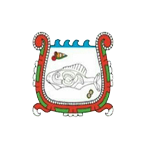

# Evaseac
Project developed in collaboration with [ENCB](https://www.encb.ipn.mx/) and [ESCOM](https://www.escom.ipn.mx/), intended to serve as a way to retrieve all the work made by [Evaseac](https://www.innovacioneduencb.ipn.mx/Evaseac/), a laboratory focused on research and teaching of aquatic ecosystems health status.

## Tech/Framework used
Built with
- C#
- HTML5, Javascript, PHP

## Credits
Coder:
- [@edoomm](https://github.com/edoomm) - Full stack developer

Enablers:
- [Laboratorio de Evaluación de la Salud de los Ecosistemas Acúaticos (Evaseac)](https://www.innovacioneduencb.ipn.mx/Evaseac/) - Users, data & requirement holders
- [Departamento de Innovación Educativa](https://www.innovacioneduencb.ipn.mx/)
- [Escuela Nacional de Ciencias Biológicas](https://www.encb.ipn.mx/)
- [Programa Institucional de Formación de Investigadores](https://pifi.ipn.mx/)
- [Instituto Politécnico Nacional](https://www.ipn.mx/)

  
  
  

